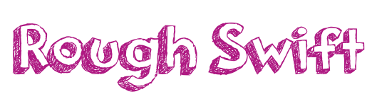
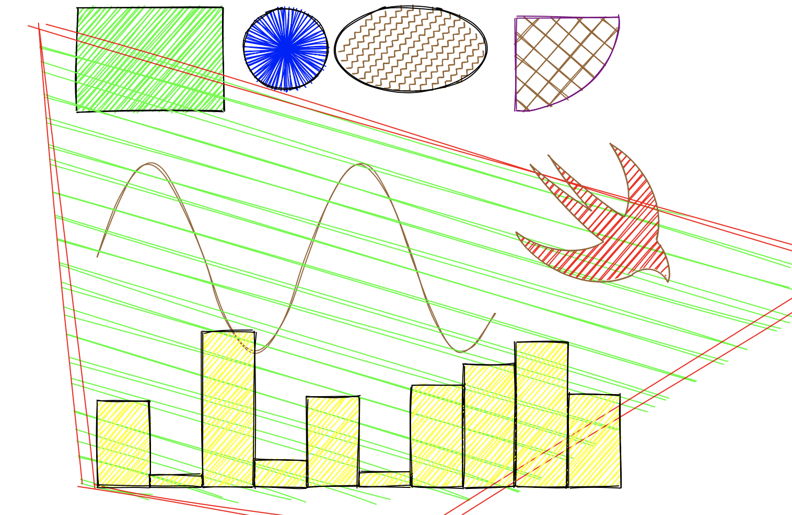
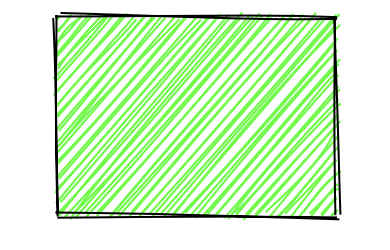
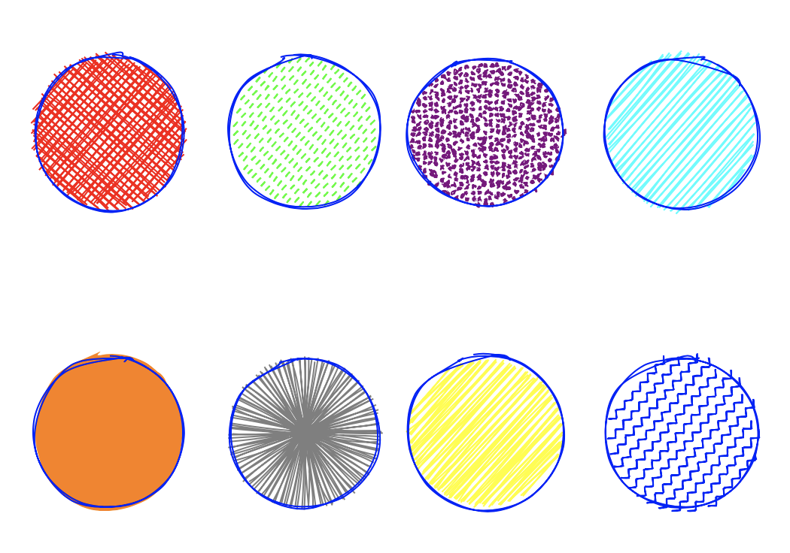
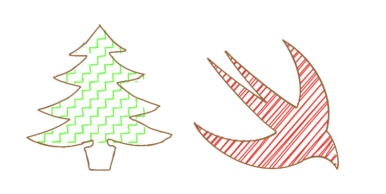
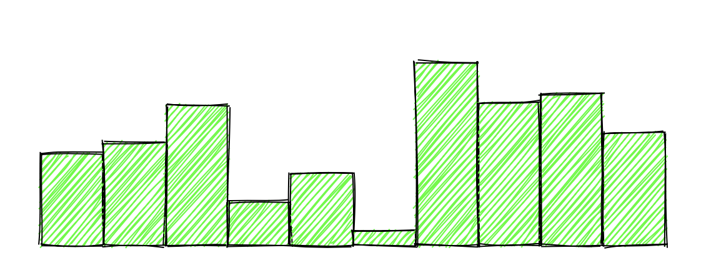

# RoughSwift

Create sketchy, hand-drawn styled graphics in iOS apps using [Rough.js](https://roughjs.com) via JavaScriptCore.





## Features

- Hand-drawn, sketchy style shapes in SwiftUI and UIKit
- Supports line, rectangle, circle, ellipse, linear path, arc, curve, polygon, SVG path
- Generates `UIBezierPath` for `CAShapeLayer`
- Multiple fill styles: hachure, solid, zigzag, crossHatch, dots, dashed
- Easy customizations with `Options`
- Composable and immutable APIs

## Requirements

- iOS 16+
- Swift 6
- Xcode 16+

## Installation

### Swift Package Manager

Add to your `Package.swift`:

```swift
dependencies: [
    .package(url: "https://github.com/onmyway133/RoughSwift", from: "3.0.0")
]
```

Or via Xcode: **File → Add Package Dependencies**.

## SwiftUI Usage

### Basic shape

```swift
RoughView()
    .fill(.yellow)
    .fillStyle(.hachure)
    .hachureAngle(-41)
    .hachureGap(-1)
    .stroke(.systemTeal)
    .strokeWidth(2)
    .rectangle()
    .frame(width: 200, height: 100)
```



### Fill styles



```swift
struct StylesView: View {
    var body: some View {
        LazyVGrid(columns: [.init(), .init(), .init()], spacing: 12) {
            RoughView().fill(.red).fillStyle(.crossHatch).circle().frame(width: 100, height: 100)
            RoughView().fill(.green).fillStyle(.dashed).circle().frame(width: 100, height: 100)
            RoughView().fill(.purple).fillStyle(.dots).circle().frame(width: 100, height: 100)
            RoughView().fill(.cyan).fillStyle(.hachure).circle().frame(width: 100, height: 100)
            RoughView().fill(.orange).fillStyle(.solid).circle().frame(width: 100, height: 100)
            RoughView().fill(.gray).fillStyle(.starBurst).circle().frame(width: 100, height: 100)
            RoughView().fill(.yellow).fillStyle(.zigzag).circle().frame(width: 100, height: 100)
            RoughView().fill(.systemTeal).fillStyle(.zigzagLine).circle().frame(width: 100, height: 100)
        }
    }
}
```

Available fill styles: `crossHatch`, `dashed`, `dots`, `hachure`, `solid`, `starBurst`, `zigzag`, `zigzagLine`

### SVG path



```swift
struct SVGView: View {
    let apple = "M85 32C115 68 239 170 281 192 311 126 274 43 244 0c97 58 146 167 121 254 28 28 40 89 29 108 -25-45-67-39-93-24C176 409 24 296 0 233c68 56 170 65 226 27C165 217 56 89 36 54c42 38 116 96 161 122C159 137 108 72 85 32z"

    var body: some View {
        RoughView()
            .stroke(.systemTeal)
            .fill(.red)
            .draw(Path(d: apple))
            .frame(width: 300, height: 300)
    }
}
```

### Chart example



```swift
struct ChartView: View {
    let heights: [CGFloat] = (0..<10).map { _ in CGFloat.random(in: 0..<150) }

    var body: some View {
        HStack {
            ForEach(0..<10, id: \.self) { index in
                VStack {
                    Spacer()
                    RoughView()
                        .fill(.yellow)
                        .rectangle()
                        .frame(height: heights[index])
                }
            }
        }
        .padding()
    }
}
```

## UIKit Usage

For direct `CALayer`-based rendering:

```swift
let layer = CALayer()
let size = CGSize(width: 200, height: 200)

let renderer = Renderer(layer: layer)
let generator = Engine.shared.generator(size: size)

let drawing = generator.generate(drawable: Rectangle(x: 10, y: 10, width: 100, height: 50))
renderer.render(drawing: drawing)
```

## Options

`Options` is an immutable struct for per-shape customization:

```swift
var options = Options()
options.roughness = 2.0
options.strokeWidth = 3
options.fill = .blue
options.stroke = .black
options.fillStyle = .hachure
options.hachureAngle = 60
options.hachureGap = 8

let drawing = generator.generate(drawable: Circle(x: 100, y: 100, diameter: 150), options: options)
```

## Credit

- [rough](https://github.com/pshihn/rough) — the generator that powers RoughSwift via JavaScriptCore
- [SVGPath](https://github.com/timrwood/SVGPath) — constructing `UIBezierPath` from SVG path

## License

RoughSwift is available under the MIT license. Copyright (c) 2019-2026 Khoa Pham.
